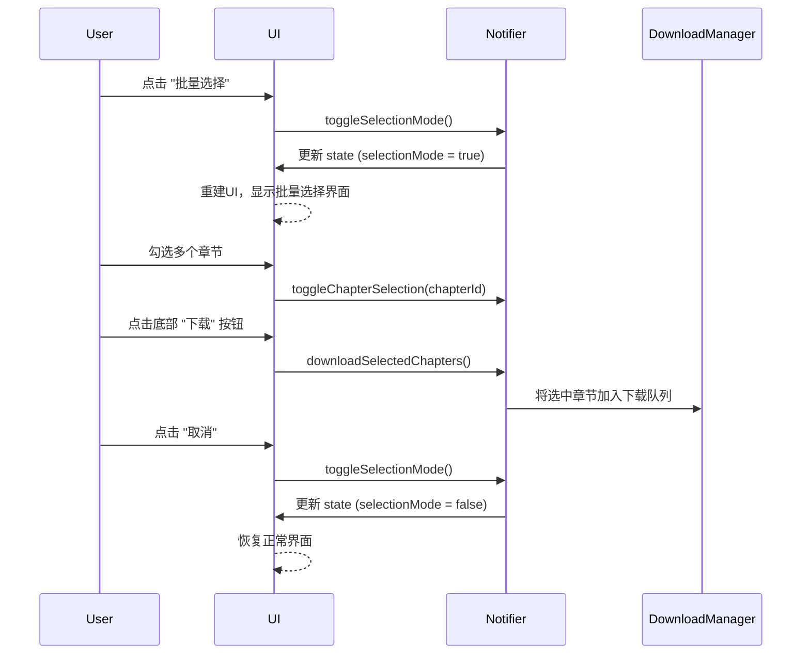

# Flutter 漫画详情页选择器 UI 优化设计方案

## 1. 概述

本文档旨在为 Flutter 漫画详情页设计一套全新的选择器 UI，以解决当前版本中分区标签切换不明确、排序功能全局化以及批量操作不够完善等问题。新方案将引入层级更清晰、功能更强大的三层选择器，并优化批量选择功能，提升用户体验。

## 2. 问题分析

- **分区不明确**: 当前的 "1-50" 式分区标签，用户无法得知是按“卷”还是“章”来划分的。
- **全局排序**: 正序/倒序功能作用于所有章节，而不是在特定分区（如某一卷）内生效。
- **批量操作**: 缺少暂停、继续、取消等更精细的批量下载控制功能。

## 3. 设计目标

- **清晰的层级结构**: 用户能明确区分“卷”和“章”，并按需筛选。
- **分区内排序**: 排序功能应与当前选择的分区（卷/章）关联。
- **强大的批量操作**: 提供完整的批量下载管理功能。
- **紧凑且响应式**: UI 布局在各种屏幕尺寸上都能良好显示，不占用过多空间。

## 4. 状态管理 (数据结构设计)

为了支持新的 UI，我们需要对 `ComicDetailState` 进行扩展。

### 4.1. `ComicDetailState` 扩展

我们将引入新的字段来管理选择器状态。

```dart
// flutter_app/lib/features/comics/comic_detail_provider.dart

enum ChapterDisplayType {
  all, // 全部
  volume, // 按卷
  chapter // 按章
}

class ComicDetailState {
  // ... existing fields

  // 1. 新增：用于第一层选择器 (卷/章节类型)
  final ChapterDisplayType chapterDisplayType;

  // 2. 新增：用于第二层选择器 (区域)
  // Key: ChapterDisplayType (all, volume, chapter)
  // Value: List of segments for that type
  final Map<ChapterDisplayType, List<ChapterSegment>> segmentMap;
  final ChapterSegment? currentSegment; // 当前选中的区域

  // 3. 新增：用于第三层选择器 (排序)
  // Key: A unique identifier for the current view (e.g., "volume-1-50" or "chapter-all")
  // Value: Sort order for that view
  final Map<String, bool> sortOrderMap; // true for descending

  // 4. 改造：原始章节列表
  final List<ComicChapter> allChapters; // 存储从API获取的完整、未排序的列表
  final List<ComicVolume> allVolumes; // 存储从 allChapters 解析出的卷信息

  // ... constructor and copyWith
}
```

### 4.2. 新增数据模型 `ComicVolume`

我们需要一个新的模型来表示“卷”。

```dart
// flutter_app/lib/features/comics/comics_models.dart

class ComicVolume {
  const ComicVolume({
    required this.id, // e.g., "volume-1"
    required this.title, // e.g., "第一卷"
    required this.chapters, // 该卷包含的章节列表
  });

  final String id;
  final String title;
  final List<ComicChapter> chapters;
}
```

### 4.3. `ComicDetailNotifier` 逻辑调整 (伪代码)

`Notifier` 需要增加逻辑来处理新的状态。

```dart
// flutter_app/lib/features/comics/comic_detail_provider.dart

class ComicDetailNotifier extends StateNotifier<ComicDetailState> {

  Future<void> refresh() async {
    // ... fetch data
    final data = await _remoteService.fetchDetail(...);

    // 1. 解析卷和章节
    final volumes = _parseVolumesFromChapters(data.chapters);
    final chaptersOnly = _extractChaptersOnly(data.chapters); // 仅包含 "第x话" 的章节

    // 2. 构建不同类型的分段
    final segmentMap = {
      ChapterDisplayType.all: _buildSegmentsFor(data.chapters),
      ChapterDisplayType.volume: _buildSegmentsFor(volumes), // 按卷分组，如 "1-10卷"
      ChapterDisplayType.chapter: _buildSegmentsFor(chaptersOnly), // 按章节分组
    };

    // 3. 设置初始状态
    state = state.copyWith(
      allChapters: data.chapters,
      allVolumes: volumes,
      segmentMap: segmentMap,
      chapterDisplayType: ChapterDisplayType.all,
      currentSegment: segmentMap[ChapterDisplayType.all]?.first,
      // ... other initial states
    );
  }

  // 当用户切换第一层 Tab (全部/卷/章)
  void setChapterDisplayType(ChapterDisplayType type) {
    final segments = state.segmentMap[type] ?? [];
    state = state.copyWith(
      chapterDisplayType: type,
      currentSegment: segments.isNotEmpty ? segments.first : null,
      // 重置选择
      selectedChapterIds: {},
      selectionMode: false,
    );
  }

  // 当用户选择第二层区域 (e.g., "1-50")
  void setSegment(ChapterSegment segment) {
    state = state.copyWith(
      currentSegment: segment,
      // 重置选择
      selectedChapterIds: {},
      selectionMode: false,
    );
  }

  // 当用户切换第三层排序
  void toggleSortOrder() {
    final key = _getCurrentViewKey(); // e.g., "volume-1-10"
    final currentOrder = state.sortOrderMap[key] ?? true; // default descending
    final newSortOrderMap = Map.from(state.sortOrderMap);
    newSortOrderMap[key] = !currentOrder;
    state = state.copyWith(sortOrderMap: newSortOrderMap);
  }

  // 获取当前可见的章节列表 (核心逻辑)
  List<ComicChapter> get visibleChapters {
    // 1. 根据 chapterDisplayType 获取基础列表 (全部/卷内章节/纯章节)
    List<ComicChapter> baseList;
    if (state.chapterDisplayType == ChapterDisplayType.volume) {
      // 从 allVolumes 中根据 currentSegment 筛选出对应卷的章节
      baseList = _getChaptersFromVolumesInSegment(state.currentSegment);
    } else {
      // 从 allChapters 或 chaptersOnly 中筛选
      baseList = _getChaptersInSegment(state.chapterDisplayType, state.currentSegment);
    }

    // 2. 根据 sortOrderMap 获取当前视图的排序方式
    final key = _getCurrentViewKey();
    final descending = state.sortOrderMap[key] ?? true;

    // 3. 排序
    return _sortChapters(baseList, descending: descending);
  }

  String _getCurrentViewKey() {
    // 生成一个代表当前视图的唯一键
    return "${state.chapterDisplayType.name}-${state.currentSegment?.label() ?? 'all'}";
  }

  // ... 其他辅助函数
}
```

## 5. UI 设计方案

我们将设计一个紧凑的、集成的选择器区域，位于漫画信息和章节列表之间。

### 5.1. 组件选择和布局

```mermaid
graph TD
    subgraph 选择器区域 (Selector Panel)
        direction TB
        A[第一层: 类型选择] --> B[第二层: 区域选择]
        B --> C[第三层: 排序 & 批量操作]
    end

    A --- |使用 TabBar 或 SegmentedButton| D{组件: TabBar}
    B --- |使用 DropdownButton 或 Chips| E{组件: DropdownButton}
    C --- |使用 Row 和 TextButton/IconButton| F{组件: Row}
```

- **整体布局**: 使用一个 `Card` 或 `Container` 包裹整个选择器区域，与页面其他部分有视觉区分。
- **第一层 (类型选择)**: 使用 `TabBar` 或 `ToggleButtons`，选项为 **"全部"**, **"卷"**, **"章节"**。这提供了最清晰的顶层分类。
- **第二层 (区域选择)**: 使用一个 `DropdownButton`。它的标签会动态显示，例如 "全部章节"、"1-50话" 或 "1-10卷"。点击后展开下拉菜单显示所有可用区域。这比水平滚动的 `Chip` 列表更节省空间，尤其是在区域很多的情况下。
- **第三层 (排序与批量)**: 使用一个 `Row`。
  - 左侧放置 **"正序/倒序"** `TextButton`。
  - 右侧放置 **"批量选择"** `IconButton`。

### 5.2. 批量选择模式 UI

当用户点击 "批量选择" 按钮后，UI 进入批量选择模式：

- **选择器区域变化**:
  - "批量选择" 按钮变为 "取消" 按钮。
  - "正序/倒序" 按钮旁边出现 "全选当前" / "取消全选" 按钮。
- **底部操作栏**: 屏幕底部出现一个 `BottomAppBar`，包含批量操作按钮：
  - **下载 (已选 N 项)**
  - **暂停**
  - **继续**
  - **删除下载**
- **章节列表项**: 每个章节项左侧出现 `Checkbox`。



## 6. 用户交互流程

1.  **默认状态**:
    - 页面加载后，默认显示 "全部" 类型的 "全部" 区域，章节列表以降序排列。
2.  **切换类型 (第一层)**:
    - 用户点击 "卷"。
    - `TabBar` 切换到 "卷"。
    - `DropdownButton` 的内容更新为卷的区域（如 "1-10卷", "11-20卷"）。
    - 章节列表更新为第一个区域（"1-10卷"）的内容，并根据该区域的排序设置（或默认降序）排列。
3.  **切换区域 (第二层)**:
    - 用户在 "卷" 类型下，点击 `DropdownButton`，选择 "11-20卷"。
    - 章节列表更新，显示 11-20 卷的章节。
4.  **切换排序 (第三层)**:
    - 用户在查看 "11-20卷" 时，点击 "正序"。
    - 只有当前列表（11-20卷的章节）变为正序。
    - 如果用户切回 "1-10卷"，排序将恢复为 "1-10卷" 上次设置的排序（或默认降序）。
5.  **批量选择**:
    - 用户点击 "批量选择" 图标。
    - UI 进入批量模式。
    - 用户勾选章节，或点击 "全选当前" 选择所有可见章节。
    - 用户点击底部 "下载" 按钮，所有选中项加入下载队列。
    - 用户点击 "取消"，退出批量模式。

## 7. 关键实现点 (伪代码)

### 7.1. 构建选择器 Widget

```dart
// in comic_detail_page.dart

Widget _buildNewSelectorPanel(BuildContext context, ComicDetailState state, ComicDetailNotifier notifier) {
  return Card(
    margin: const EdgeInsets.all(12),
    child: Padding(
      padding: const EdgeInsets.all(12.0),
      child: Column(
        children: [
          // 第一层: 类型选择
          ToggleButtons(
            isSelected: [
              state.chapterDisplayType == ChapterDisplayType.all,
              state.chapterDisplayType == ChapterDisplayType.volume,
              state.chapterDisplayType == ChapterDisplayType.chapter,
            ],
            onPressed: (index) {
              notifier.setChapterDisplayType(ChapterDisplayType.values[index]);
            },
            children: const [Text('全部'), Text('卷'), Text('章节')],
          ),
          const SizedBox(height: 12),

          // 第二层和第三层
          Row(
            children: [
              // 第二层: 区域选择
              Expanded(
                child: DropdownButton<ChapterSegment>(
                  value: state.currentSegment,
                  isExpanded: true,
                  items: (state.segmentMap[state.chapterDisplayType] ?? []).map((segment) {
                    return DropdownMenuItem(
                      value: segment,
                      child: Text(segment.label()),
                    );
                  }).toList(),
                  onChanged: (segment) {
                    if (segment != null) {
                      notifier.setSegment(segment);
                    }
                  },
                ),
              ),
              const SizedBox(width: 16),

              // 第三层: 排序
              TextButton.icon(
                onPressed: notifier.toggleSortOrder,
                icon: Icon(
                  (state.sortOrderMap[_getCurrentViewKey()] ?? true) ? Icons.arrow_downward : Icons.arrow_upward,
                ),
                label: Text((state.sortOrderMap[_getCurrentViewKey()] ?? true) ? '倒序' : '正序'),
              ),

              // 第三层: 批量选择
              IconButton(
                icon: Icon(state.selectionMode ? Icons.close : Icons.select_all),
                onPressed: notifier.toggleSelectionMode,
              ),
            ],
          ),

          // 批量选择模式下的额外按钮
          if (state.selectionMode)
            Row(
              mainAxisAlignment: MainAxisAlignment.end,
              children: [
                TextButton(onPressed: notifier.selectAllVisibleChapters, child: Text('全选当前')),
                TextButton(onPressed: notifier.clearSelection, child: Text('清空选择')),
              ],
            )
        ],
      ),
    ),
  );
}
```

### 7.2. 解析卷和章节的逻辑

```dart
// in comic_detail_provider.dart

List<ComicVolume> _parseVolumesFromChapters(List<ComicChapter> allChapters) {
  // 这是一个简化的例子。实际实现需要更复杂的逻辑来识别卷标。
  // 例如，通过正则表达式匹配 "第xx卷" 或 "Vol.xx"。
  final Map<String, List<ComicChapter>> volumeMap = {};
  for (final chapter in allChapters) {
    final volMatch = RegExp(r'(第\d+卷|Vol\.\d+)', caseSensitive: false).firstMatch(chapter.title);
    if (volMatch != null) {
      final volumeTitle = volMatch.group(0)!;
      if (volumeMap.containsKey(volumeTitle)) {
        volumeMap[volumeTitle]!.add(chapter);
      } else {
        volumeMap[volumeTitle] = [chapter];
      }
    }
  }

  return volumeMap.entries.map((entry) {
    return ComicVolume(id: entry.key, title: entry.key, chapters: entry.value);
  }).toList();
}
```

## 8. 总结

该设计方案通过引入三层选择器和优化的数据结构，系统地解决了当前 UI 存在的问题。它为用户提供了更清晰、更灵活的章节浏览和管理体验。下一步是根据此设计方案进行具体的代码实现。
